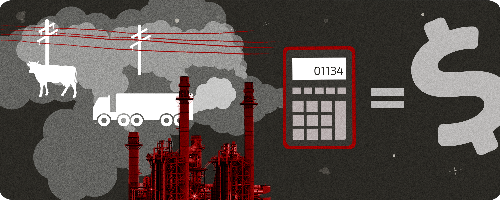

### Setup and storing functions

```{r setup, include = TRUE, message = FALSE, warning = FALSE}
knitr::opts_chunk$set(echo = TRUE, warning = FALSE, message = FALSE)
library(here)
library(tidyverse)
library(janitor)
library(broom)
library(equatiomatic)

options(scipen = 999)


electricity <- read_csv(here("HW3_data.csv")) %>% 
  clean_names() %>% 
  select(-1)

# running linear models to get demand curves for high and low income consumers
model_demand_l <- lm(price_cents  ~ q_low_kwh, data = electricity)
model_demand_h <- lm(price_cents ~ q_high_kwh, data = electricity)


## FUNCTIONS

# demand 
demand <- function(p, model){
  q <- (p - model$coefficients[[1]])/model$coefficients[[2]]
  q <- ifelse(q<0,0,q)
  return(q)
}

# aggregate demand
demand_agg <- function(p){
  q <- demand(p, model_demand_l) + demand(p, model_demand_h)
  return(q)
}

# consumer surplus
CS <- function(p, model){
  q <- demand(p, model)
  cs <- 0.5*(model$coefficients[[1]] - p)*q
  return(cs)
}

# aggregate consumer surplus
CS_agg <- function(p){
  cs <- CS(p,model_demand_l) + CS(p,model_demand_h)
  return(cs)
}

# marginal cost functions
mc_slope <- 10/demand_agg(10)
# marginal cost function
mc <- function(q){
  p <- q*(mc_slope)
  return(p)
}

mc_q <- function(p){
  p/mc_slope
}

# determining marginal external cost
metric_ton <- 2204.62
mec_cents <- (0.85/metric_ton)*100*51

```

### Visualization
FIGURE THIS OUT
```{r, include = FALSE}
# creating a table for demand based on the linear model
price_vector <- c(0:35)
table <- data.frame(price_vector)
demand_table <- table %>% 
  mutate(demand_low = demand(price_vector, model = model_demand_l)) %>% 
  mutate(demand_high = demand(price_vector, model = model_demand_h)) %>% 
  mutate(demand_agg = demand_agg(price_vector)) %>% 
  rename(price_cents = price_vector) %>% 
  mutate(marginal_cost = mc(demand_agg))

demand_table_longer <- demand_table %>% 
  pivot_longer(2:5, names_to = "demand_level", values_to = "demand")

# plotting supply and demand
ggplot(data = demand_table_longer, aes(x = demand, y = price_cents, color = demand_level)) +
  geom_line(size = 1) +
  theme_minimal(14) +
  scale_color_manual(values = c("darkblue", "cyan4", "cadetblue3", "black", "firebrick")) +
  scale_x_continuous(limits = c(1, 9e+05)) +
  theme(legend.position = c(0.8, 0.7)) + 
  geom_line(data = demand_table_longer, aes(x = demand, y = mec_cents + mc_slope*demand),
            color = "forestgreen",
            size = 1) +
  geom_line(data = demand_table_longer, aes(x = demand, y = mec_cents),
            color = "firebrick",
            size = 1) +
  labs(x = "kWh electricity used", y= "Price (cents)") +
  theme(legend.title = element_blank())

```

### 1. Price per kwh of electricity

```{r}
metric_ton <- 2204.62
price_per_kwh_cents<- (0.85/metric_ton)*100*51
```

**Marginal external cost per kWh of electricity:** `r round(mec_cents, 2)` cents

### 2. Supply and demand curves, consumer/producer benefits

```{r}
# storing slopes and intercepts of each equation to report inline code 
int_high <- model_demand_h$coefficients[1]
slope_high <- model_demand_h$coefficients[2]
int_low <- model_demand_l$coefficients[1]
slope_low <- model_demand_l$coefficients[2]

# calculating surpluses and environmental costs
cs2 <- CS_agg(10) # consumer surplus
ps2 <- 10*demand_agg(10)/2 # producer surplus
enviro_cost_3 <- mec_cents*demand_agg(10) # environmental cost
```

**Demand curve for high income consumers:** P = `r round(int_high, 2)` `r round(slope_high, 6)`Q

**Demand curve for low income consumers:** P = `r round(int_low, 2)` `r round(slope_low, 5)`Q

**Aggregate demand curve:** To find the aggregate demand curve, horizontally sum the two demand curves above. **FIND ANSWER TO THIS**

**Supply curve:** P = `r round(mc_slope, 6)`Q

**Consumer benefit:** \$`r round(cs2/100, 2)` 

**Producer benefit:** \$`r round(ps2/100, 2)`

**Environmental Cost:** $`r round(enviro_cost_3/100, 2)`

### 3. Consumer benefit by population

```{r}
# finding the consumer surplus for each income group
cs_low3 <- CS(10, model_demand_l) # consum
cs_high3 <- CS(10, model = model_demand_h)
```

**Consumer benefit for high income consumers:** $`r round (cs_high3/100, 2)`

**Consumer benefit for low income consumers:** $`r round (cs_low3/100, 2)`


### 4. Optimal electricity tax

```{r}
# finding the new demand curve under the tax 
demand_after_tax <- function(p, model){
  q <- (p - model$coefficients[[1]] + mec_cents)/model$coefficients[[2]]
  q <- ifelse(q<0,0,q)
  return(q)
}

# aggregate demand curve function after tax
demand_agg_after_tax <- function(p){
  q <- demand_after_tax(p, model_demand_l) + demand_after_tax(p, model_demand_h)
  return(q)
}
# setting the functions equal to determine new equilibrium price after tax
uniroot_after_tax <- uniroot(function(p)
  demand_agg_after_tax(p) - mc_q(p),
        interval = c(0,20))

# new consumer surplus function
CS_after_tax <- function(p, model){
  q <- demand_after_tax(p, model)
  cs <- 0.5*(model$coefficients[[1]] - p)*q
  return(cs)
}

price_after_tax<- uniroot_after_tax$root

# amount of electricity consumed after tax
demand_agg_after_tax<- demand_agg_after_tax(price_after_tax)

# overall welfare to high and low income consumers
cs_high_after_tax <- 
cs_low_after_tax <- 

# welfare for electricity producer
ps_after_tax <- 
  
  
# total environmental damage
enviro_damage_after_tax <- mec_cents*demand_agg_after_tax(price_after_tax)
  
tax_revenue <- mec_cents*demand_agg_after_tax(price_after_tax)

```

**Optimal Electricity Tax:** `r round(mec_cents, 2)` cents

A. **The amount of electricity produced and consumed:** `r round(demand_agg_after_tax, 2)`kWh

B. **The price of electricity:** `r round(price_after_tax, 2)` cents per kWh before the tax is applied

C. **Overall welfare of “high” income consumers:** $`r round(cs_high_after_tax/100, 2)`

D. **Overall welfare of “low” income consumers:** $`r round(cs_low_after_tax/100, 2)`

E. **Power suppliers:** $`r round(ps_after_tax/100, 3)`

F. **Total environmental damage:** $`r round(enviro_damage_after_tax/100, 2)`

G. **Total tax revenue generated:** $`r round(tax_revenue/100, 2)`

### 5. Tax redistribution

```{r}
# calculating relative electricity use under the status quo 

```

Make a table for this that includes:
(a) Overall welfare of “high” income consumers
(b) Overall welfare of “low” income consumers
(c) Electricity producers

### 6. Solar generation

(a) What is total electricity consumption?
(b) What is the total environmental externality?
(c) What value of the electricity tax makes the total environmental damage the same as the
damage when solar panels are available to the high income group?